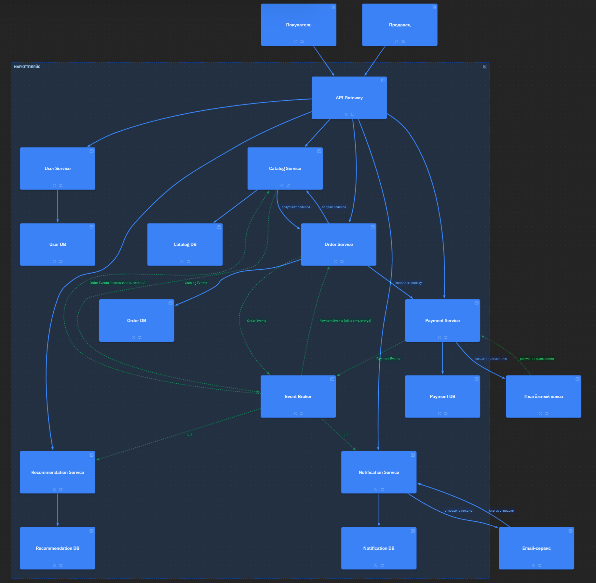

# Маркетплейс — архитектурное проектирование

## Архитектура

Маркетплейс спроектирован по микросервисной архитектуре с выделением шести основных доменов. Каждый домен реализован отдельным сервисом с собственной базой данных. Все запросы проходят через единую точку входа в лице API Gateway.

Для асинхронного взаимодействия между сервисами используется брокер сообщений (RabbitMQ/Kafka), что позволяет слабо связать сервисы и обеспечить надёжную обработку событий.

---

## C4 диаграмма



*Исходник: `c4/my_arc.likec4`*

---

## Домены и сервисы

| Домен | Сервис | Ответственность |
|-------|--------|------------------|
| User | User Service | Регистрация, профили, роли |
| Catalog | Catalog Service | Товары, категории, поиск |
| Order | Order Service | Заказы, корзина, статусы |
| Payment | Payment Service | Транзакции, платежи |
| Notification | Notification Service | Email/push-уведомления |
| Recommendation | Recommendation Service | Персонализированная лента |

---

## Границы данных

| Сервис | Данные |
|--------|--------|
| User Service | Пользователи, хеши паролей |
| Catalog Service | Товары, категории, остатки |
| Order Service | Заказы, позиции |
| Payment Service | Транзакции, счета |
| Notification Service | Логи отправок, шаблоны |
| Recommendation Service | События просмотров, рекомендации |

**Общей БД нет.** Каждый сервис владеет только своей БД.

---

## Взаимодействия

### Синхронные (HTTP)
- API Gateway -> все сервисы
- Order Service -> Payment Service (создать платеж)
- Order Service -> Catalog Service (резерв товара)
- Payment Service -> внешний платёжный шлюз
- Notification Service -> внешний Email-сервис

### Асинхронные (брокер)
- Order Service -> брокер: события заказов
- Payment Service -> брокер: события платежей
- Catalog Service -> брокер: события каталога
- Брокер -> Notification Service: уведомления
- Брокер -> Order Service: обновление статуса после оплаты
- Брокер -> Catalog Service: восстановление остатков при отказе
- Брокер -> Recommendation Service: обновление ленты

---

## Альтернативные варианты

Когда я думал, как разбить маркетплейс на сервисы, рассматривал три варианта. Расскажу про каждый.

---

### Вариант А: Монолит

**Что это:** Все домены в одном приложении, одна база данных на всё. Код лежит в одной папке, всё деплоится одним артефактом.

**Плюсы:**
- **Простота разработки** — не надо думать про сетевые вызовы между сервисами, всё в одном месте
- **ACID транзакции** — можно обновлять заказ, списывать товар и проводить платёж в одной транзакции, не надо придумывать саги
- **Нет сетевых задержек** — всё внутри одного процесса, быстро
- **Простой деплой** — залил один артефакт на сервер и всё работает

**Минусы:**
- **Масштабирование только вертикальное** — если нагрузка на каталог выросла, приходится масштабировать всё приложение целиком, даже те части, которые не нагружены (например, уведомления)
- **Высокое зацепление** — изменение в коде платежей может сломать оформление заказа
- **Технологическое застывание** — нельзя взять Elasticsearch для поиска по каталогу и PostgreSQL для платежей, всё должно быть на одном стеке
- **Риск полного отказа** — если падает один модуль (например, утечка памяти в рекомендациях), ложится весь маркетплейс

---

### Вариант Б: Группировка по бизнес-функциям (3 сервиса)

**Что это:** 
- **Core Service** (User + Order + Payment) — всё, что связано с пользователями, заказами и деньгами
- **Catalog Service** (Catalog + Recommendation) — товары и лента
- **Notification Service** — отдельно, потому что он слабо связан с остальными

**Плюсы:**
- **Меньше сервисов** — проще оркестровать, чем 6 штук
- **Меньше сетевых вызовов** — внутри Core Service можно вызывать методы напрямую, без HTTP
- **Баланс** — не такой жёсткий монолит, но и не полный набор из микросервисов

**Минусы:**
- **Внутри групп связанность остаётся** — в Core Service изменение в платежах может затронуть заказы, и деплоить придётся всё вместе
- **Масштабирование негибкое** — если нагрузка только на заказы, масштабировать придётся весь Core Service вместе с пользователями и платежами
- **Сложность разделения команд** — над Core Service будет работать несколько команд, и они могут мешать друг о другу

---

### Вариант В: Микросервисы (это я в итоге и выбрал)

**Что это:** Каждый домен — отдельный сервис со своей БД, API Gateway, брокер сообщений.

**Плюсы:**
- **Независимость** — каждый сервис можно разрабатывать, тестировать и деплоить отдельно
- **Масштабирование только нужного** — если нагрузка только на каталог, я могу расширить Catalog Service, а Notification Service оставить один
- **Изоляция сбоев** — если упал Payment Service, каталог и лента продолжают работать, пользователи хотя бы могут смотреть товары
- **Технологическая гибкость** — для каталога можно взять Elasticsearch, для ленты — Redis, для платежей — PostgreSQL, это не мешает друг другу
- **Командная работа** — можно нанять отдельную команду на каждый сервис, они не будут мешаться

**Минусы:**
- **Сложность разработки** — в сравнении с монолитом, тут очевидно больше работы по распределению и взаимодействию блоков
- **Сетевые задержки** — каждый вызов между сервисами идёт по сети, это медленнее, чем вызов в памяти
- **Сложная инфраструктура** — нужен API Gateway, сервис-дискавери, брокер, логгирование

---

## Trade-off'ы

| Критерий | Монолит | Группировка | Микросервисы |
|----------|---------|------------------|-------------------|
| Скорость разработки на старте | быстро | средне | медленно |
| Масштабируемость | никакая | частичная | полная |
| Отказоустойчивость | плохая | средняя | хорошая |
| Сложность инфраструктуры | низкая | средняя | высокая |
| Гибкость в технологиях | нет | ограничена | полная |
| Распределение команд | все в одном | можно разделить | идеально |

---

## Обоснование выбора

Микросервисы выбраны, потому что:
- Требуется независимое масштабирование (каталог и лента — самые нагруженные)
- Нужна изоляция сбоев (отказ платежей не ломает каталог)
- Каждый домен может использовать свои технологии (поиск, рекомендации)

---

## Запуск сервиса

```bash
cd hw_1
docker-compose up --build
curl http://localhost:8000/health   # → {"status":"ok"}
```

## Генерация C4 диаграммы

```bash
cd c4
docker build -t likec4-gen .
docker run --rm -v ${PWD}:/workspace -v ${PWD}/../:/output likec4-gen
```
